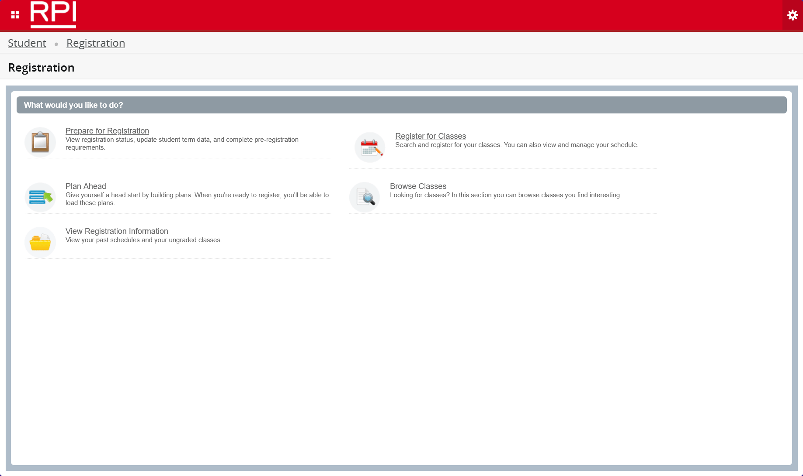
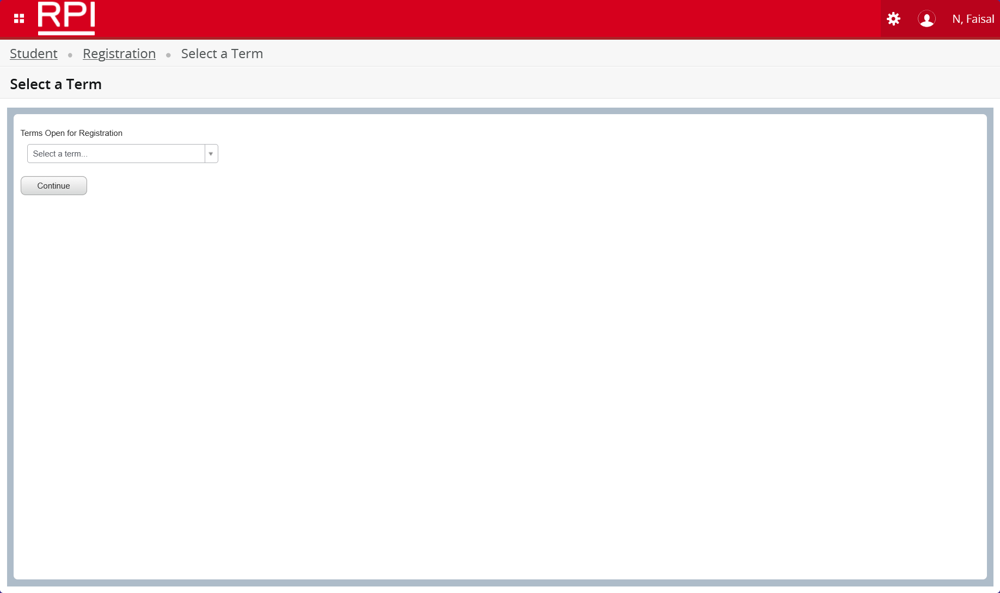
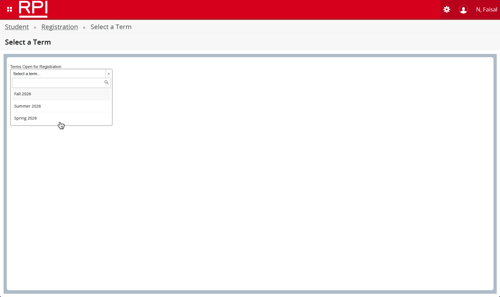
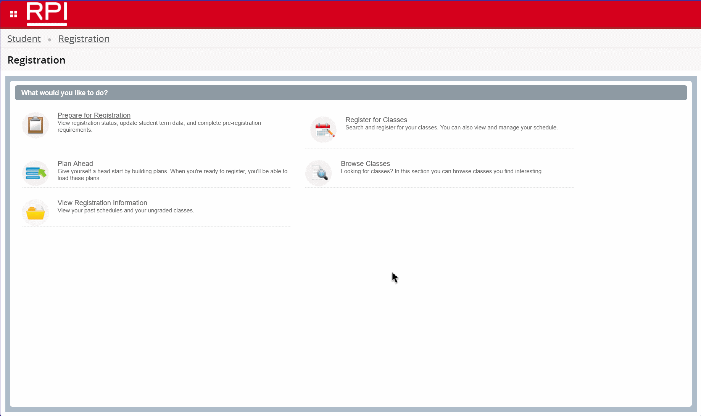

# Prefill Registration

Automatically pre-fill course section CRNs or select a template for instant RPI class registration when your time ticket is activated.

- `userscript.js` - TamperMonkey UserScript (or any compatible UserScript manager).
- `subscript.js` - Subscripts subscript. Compatible only with Subscripts.

## User Guide

> [!NOTE]
> Prefill will automatically assume your role is Student and save you a few clicks as you navigate around SIS. If you are a non-student, do not use this script.

> [!NOTE]
> Prefill will only be active on SIS registration pages. The script will not run on other pages for security. Paranoids may choose to exclude Prefill from accessing outside of `https://sis9.rpi.edu/StudentRegistrationSsb*`.

> [!IMPORTANT]
> Press and hold your Escape key at any time to stop Prefill. Re-activate by reloading the page.

> [!TIP]
> For CRN prefill to work, you'll need to have a plan set up. You can create a plan before your registration by [clicking here](https://sis9.rpi.edu/StudentRegistrationSsb/ssb/registration), then "Plan Ahead". Follow the steps to create a new plan. Make sure that the plan you want is set as your preferred plan. Without a plan, Prefill will do everything detailed *except* prefill (only steps 1 - 4).

> [!CAUTION]
> When creating a plan, ensure that you have specified a specific section number to register for instead of the entire course (any section). You need to specific sections to prefill their CRNs.

> [!CAUTION]
> Prefill has been tested on Chromium and Firefox-based browsers. It should work on all browsers that SIS supports. If your browser does not support the Tampermonkey browser extension, use the browser console instead. Ensure [prerequisites](#prerequisites) are met before running.

> [!NOTE]
> Prefill keeps your SIS Registration session open and active while the script is enabled. Nobody likes it when SIS logs you out.

Once the script is enabled via browser console or browser extension, open SIS and attempt to register for classes before your Time Ticket opens.

1. [Start here](https://sis9.rpi.edu/StudentRegistrationSsb/ssb/registration). You'll need to login with your RCSID to continue.
2. Click "Register for Classes" as highlighted.
   
3. Select the upcoming registration term from the list as violently highlighted.
   
4. Once a term is selected, Prefill will automatically attempt to proceed with registration before your time ticket opens.
   
5. If a plan has been created, Prefill will attempt to register for the classes. You'll see any conflicts or restrictions as a notification on the top-right of your screen. If there are no conflicts, your registration will be processed for you and you'll be good to go.
   

> [!TIP]
> Subscripts users will have the option to enter a custom time ticket date and time to prevent spam requests and IP bans. Subscripts is currently not in development, with plans to be released in 2027. Feel free to create a pull request against [faisalnjs/subscripts](https://github.com/faisalnjs/subscripts) to get the ball rolling. Support for Chromium and Firefox-based browsers is intended.

## Prerequisites

- A modern browser (Chrome, Edge, Firefox, Chromium, Chromium-based, Firefox-based, etc.)
- Tampermonkey browser extension (or any compatible UserScript manager), or Subscripts, or browser console access
- An RCSID account with access to SIS
- Primary user role as Student

## Install

### Install with Tampermonkey (recommended)

1. Install Tampermonkey for your browser:
   - Chrome/Edge/Chromium/Chromium-based via the Chrome Web Store.
   - Firefox/Firefox-based via Mozilla Add-ons.
2. Open the script's raw URL in the browser to install, or paste the URL into open the extension dashboard > Utilities > Import from URL.

   `https://raw.githubusercontent.com/faisalnjs/prefill-registration/refs/heads/main/userscript.js`

3. Tampermonkey should detect the script. Click **Install** and accept the requested [permissions](#permissions).
4. Tampermonkey will automatically update your script when we make updates in the future to fix bugs and add features.

### Run from Browser Console (no extension required)

> [!IMPORTANT]
> This process will need to be done on every page the system redirects you to.

1. Open the browser console on the SIS registration page (right-click > Inspect > Console).
2. Paste the script function into the console and press Enter to run.

## Permissions

Prefill requires the following Tampermonkey permissions:

- `GM_xmlhttpRequest` - used to fetch the preferred plan when needed.
- `GM_addStyle` - injects CSS to hide some spinners, notifications, and errors.
- `unsafeWindow` - used to interact with the page context when necessary.

## Security & privacy

- The script runs locally in your browser and does not transmit your credentials to external services.
- Review the script before installing if you have concerns.

## Author

(c) 2026 Faisal N - [faisaln.com](https://faisaln.com)
